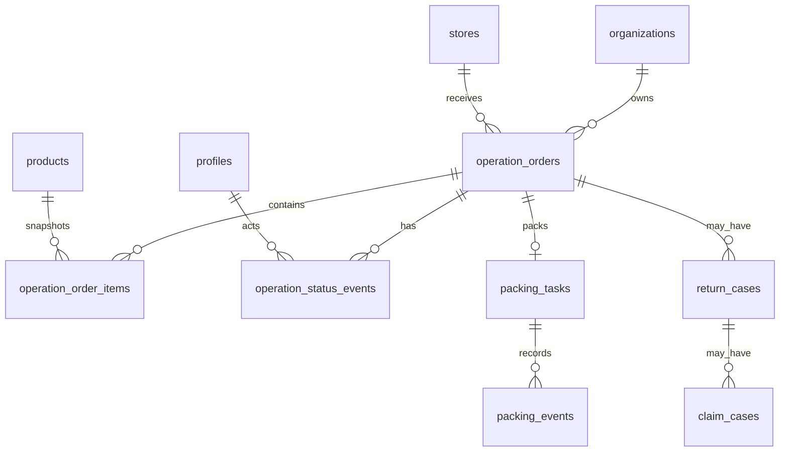

# Operations Data Model

Issue: Design Supabase Data Model for Operations

This document designs the production Supabase model for the current mock operations flow:
orders, packing, returns, claims, timelines, and analytics. It is intentionally design-only.
The next phase should create the migration from this plan.

## Current State

- Product, campaign, alert, audit, store, and subscription data already use `organization_id`.
- RLS helpers already exist:
  - `is_super_admin()`
  - `is_org_member(target_organization_id uuid)`
  - `is_org_owner_or_staff(target_organization_id uuid)`
- Operations UI currently reads mock data from `lib/operations-mock.ts`.
- Existing routes must continue to work in mock mode:
  - `/app/orders`
  - `/app/orders/packing`
  - `/app/orders/returns`
- Marketplace APIs are not connected yet. Imported marketplace identifiers should be stored, but sync remains mock until CRUD is stable.

## Design Goals

- Keep multi-tenant isolation with `organization_id` on every operations table.
- Store marketplace order identifiers without depending on live APIs.
- Preserve an append-only status timeline for each order.
- Support real CRUD for orders first, then returns and claims.
- Support mobile analytics without expensive joins.
- Keep enough snapshots on order items and claims so historical records do not change when product data changes later.
- Avoid unsafe cross-tenant references by using composite tenant foreign keys where needed.

## Entity Map



## Status Values

Use English slugs in the database and map them to Thai UI labels in application code.

### Order Status

| Value | Current Thai UI Equivalent | Meaning |
| --- | --- | --- |
| `pending_label` | รอพิมพ์ใบ | Paid order needs a label. |
| `picking` | รอหยิบของ | Label printed, warehouse picking next. |
| `packing` | กำลังแพ็ก | Items are being checked and packed. |
| `ready_to_ship` | พร้อมส่ง | Packed and waiting for carrier pickup. |
| `carrier_collected` | ขนส่งรับแล้ว | Carrier has collected the parcel. |
| `in_transit` | กำลังจัดส่ง | Shipment is moving. |
| `delivered` | ส่งสำเร็จ | Customer received the parcel. |
| `issue` | มีปัญหา | Needs manual attention. |
| `cancelled` | ยกเลิก | Cancelled before completion. |

### Packing Status

| Value | Meaning |
| --- | --- |
| `not_started` | Task exists but scan has not started. |
| `scanning` | Staff is checking SKU/quantity. |
| `packed` | Items are packed but not released. |
| `ready_to_ship` | Packed and ready for carrier pickup. |
| `blocked` | Packing is blocked by mismatch/damage/stock issue. |

### Return Case Status

| Value | Meaning |
| --- | --- |
| `opened` | Case opened by customer, marketplace, or staff. |
| `awaiting_evidence` | Waiting for photo/video/logistics evidence. |
| `in_review` | Staff is reviewing the case. |
| `return_in_transit` | Parcel is returning to seller. |
| `received` | Returned parcel received. |
| `restocked` | Item returned to sellable stock. |
| `refund_pending` | Refund action is pending. |
| `resolved` | Case is closed. |
| `rejected` | Case rejected or not accepted. |

### Claim Case Status

| Value | Meaning |
| --- | --- |
| `opened` | Claim created. |
| `evidence_needed` | More evidence is needed. |
| `submitted` | Claim submitted to marketplace/carrier manually. |
| `approved` | Claim approved. |
| `rejected` | Claim rejected. |
| `paid` | Compensation received. |
| `written_off` | Loss accepted internally. |

## Proposed Tables

### `operation_orders`

Production source of truth for order cards, packing links, order timelines, and dashboard counts.

| Column | Type | Notes |
| --- | --- | --- |
| `id` | `uuid primary key default gen_random_uuid()` | Internal id. |
| `organization_id` | `uuid not null references organizations(id) on delete cascade` | Tenant boundary. |
| `store_id` | `uuid references stores(id)` | Store that received the order. Should use tenant-safe FK in migration. |
| `platform` | `marketplace_platform not null` | Shopee/Lazada/TikTok. |
| `external_order_id` | `text` | Marketplace id, nullable during manual/demo entry. |
| `order_number` | `text not null` | Seller-visible order code. |
| `customer_name` | `text not null default ''` | Display name only. Avoid storing more PII in Phase 2. |
| `status` | `operation_order_status not null default 'pending_label'` | Current status. |
| `priority` | `operation_priority not null default 'normal'` | `normal`, `urgent`, `risk`. |
| `paid_at` | `timestamptz` | Payment time if known. |
| `pack_by` | `timestamptz` | Packing SLA. |
| `ship_by` | `timestamptz` | Shipping SLA. |
| `carrier` | `text` | Kerry/J&T/Flash/etc. |
| `tracking_number` | `text` | May be blank until label created. |
| `currency` | `text not null default 'THB'` | Future multi-country support. |
| `subtotal_amount` | `numeric(12,2) not null default 0` | Items before discounts. |
| `discount_amount` | `numeric(12,2) not null default 0` | Seller/marketplace discount snapshot. |
| `shipping_amount` | `numeric(12,2) not null default 0` | Customer-paid shipping or shipping fee snapshot. |
| `total_amount` | `numeric(12,2) not null default 0` | Order total snapshot. |
| `note` | `text` | Staff note. |
| `source` | `text not null default 'mock'` | `mock`, `manual`, `shopee`, `lazada`, `tiktok`. |
| `metadata` | `jsonb not null default '{}'::jsonb` | Raw-ish non-sensitive payload and UI hints. |
| `created_at` | `timestamptz not null default now()` | Created locally. |
| `updated_at` | `timestamptz not null default now()` | Updated by trigger or app. |

Constraints and indexes:

- `unique (organization_id, order_number)`
- `unique (organization_id, platform, external_order_id)` where `external_order_id is not null`
- `index (organization_id, status, pack_by)`
- `index (organization_id, platform, created_at desc)`
- `index (organization_id, tracking_number)` where `tracking_number is not null`

### `operation_order_items`

Line items and product snapshots. This allows order history to stay correct even if a product name/cost changes.

| Column | Type | Notes |
| --- | --- | --- |
| `id` | `uuid primary key default gen_random_uuid()` | Internal id. |
| `organization_id` | `uuid not null references organizations(id) on delete cascade` | Tenant boundary. |
| `order_id` | `uuid not null references operation_orders(id) on delete cascade` | Parent order. |
| `product_id` | `uuid references products(id)` | Nullable for marketplace SKUs not mapped yet. |
| `sku` | `text not null` | Snapshot SKU. |
| `name` | `text not null` | Snapshot product title. |
| `quantity` | `int not null check (quantity > 0)` | Quantity ordered. |
| `unit_price` | `numeric(12,2) not null default 0` | Sale price snapshot. |
| `unit_cost` | `numeric(12,2) not null default 0` | Cost snapshot for analytics. |
| `metadata` | `jsonb not null default '{}'::jsonb` | Options, variation, image, raw item payload. |
| `created_at` | `timestamptz not null default now()` | Created locally. |

Constraints and indexes:

- Tenant-safe FK: `(organization_id, order_id)` should reference `operation_orders(organization_id, id)`.
- Tenant-safe optional FK: `(organization_id, product_id)` should reference `products(organization_id, id)` after adding a composite unique index on products.
- `index (organization_id, sku)`
- `index (organization_id, order_id)`

### `operation_status_events`

Append-only timeline for actions such as print label, start packing, ready to ship, report issue, carrier pickup.

| Column | Type | Notes |
| --- | --- | --- |
| `id` | `uuid primary key default gen_random_uuid()` | Internal id. |
| `organization_id` | `uuid not null references organizations(id) on delete cascade` | Tenant boundary. |
| `order_id` | `uuid not null references operation_orders(id) on delete cascade` | Parent order. |
| `event_type` | `operation_event_type not null` | Action/event slug. |
| `from_status` | `operation_order_status` | Nullable for first import. |
| `to_status` | `operation_order_status` | Nullable for non-status event. |
| `actor_profile_id` | `uuid references commerce_profiles(id)` | Staff/system actor. |
| `note` | `text` | Human-readable event note. |
| `metadata` | `jsonb not null default '{}'::jsonb` | Scan result, source, UI action id, etc. |
| `created_at` | `timestamptz not null default now()` | Event time. |

Constraints and indexes:

- Tenant-safe FK: `(organization_id, order_id)` references `operation_orders(organization_id, id)`.
- `index (organization_id, order_id, created_at)`
- `index (organization_id, event_type, created_at desc)`
- Do not allow updates/deletes through normal app clients. Corrections should append another event.

### `packing_tasks`

One active packing workflow per order. This makes `/app/orders/packing` CRUD easy without mutating item snapshots.

| Column | Type | Notes |
| --- | --- | --- |
| `id` | `uuid primary key default gen_random_uuid()` | Internal id. |
| `organization_id` | `uuid not null references organizations(id) on delete cascade` | Tenant boundary. |
| `order_id` | `uuid not null references operation_orders(id) on delete cascade` | Parent order. |
| `status` | `packing_status not null default 'not_started'` | Current packing task status. |
| `assigned_to` | `uuid references commerce_profiles(id)` | Staff member. |
| `started_at` | `timestamptz` | First scan/start. |
| `completed_at` | `timestamptz` | Packed/ready time. |
| `checked_item_count` | `int not null default 0` | Mobile progress count. |
| `issue_count` | `int not null default 0` | Mismatch/damage/stock issues. |
| `note` | `text` | Staff packing note. |
| `metadata` | `jsonb not null default '{}'::jsonb` | Device/session hints, photo refs later. |
| `created_at` | `timestamptz not null default now()` | Created locally. |
| `updated_at` | `timestamptz not null default now()` | Updated by trigger or app. |

Constraints and indexes:

- `unique (organization_id, order_id)`
- `index (organization_id, status, updated_at desc)`

### `packing_events`

Fine-grained packing audit trail: label printed, SKU scanned, mismatch, ready button clicked.

| Column | Type | Notes |
| --- | --- | --- |
| `id` | `uuid primary key default gen_random_uuid()` | Internal id. |
| `organization_id` | `uuid not null references organizations(id) on delete cascade` | Tenant boundary. |
| `packing_task_id` | `uuid not null references packing_tasks(id) on delete cascade` | Parent task. |
| `order_id` | `uuid not null references operation_orders(id) on delete cascade` | Denormalized for easy timeline/analytics. |
| `event_type` | `packing_event_type not null` | `label_printed`, `scan_matched`, `scan_mismatch`, `packed`, `ready_to_ship`, `blocked`. |
| `sku` | `text` | Scanned SKU if relevant. |
| `quantity` | `int` | Quantity checked if relevant. |
| `actor_profile_id` | `uuid references commerce_profiles(id)` | Staff/system actor. |
| `note` | `text` | Human note. |
| `metadata` | `jsonb not null default '{}'::jsonb` | Scanner payload or future photo refs. |
| `created_at` | `timestamptz not null default now()` | Event time. |

Indexes:

- `index (organization_id, packing_task_id, created_at)`
- `index (organization_id, order_id, created_at)`
- `index (organization_id, event_type, created_at desc)`

### `return_cases`

Customer return/refund/refused delivery workflow. Claims can link to this table.

| Column | Type | Notes |
| --- | --- | --- |
| `id` | `uuid primary key default gen_random_uuid()` | Internal id. |
| `organization_id` | `uuid not null references organizations(id) on delete cascade` | Tenant boundary. |
| `order_id` | `uuid references operation_orders(id) on delete set null` | Related order if known. |
| `case_number` | `text not null` | Seller-visible case code. |
| `platform` | `marketplace_platform not null` | Shopee/Lazada/TikTok. |
| `external_case_id` | `text` | Marketplace case id later. |
| `case_type` | `return_case_type not null default 'return'` | `return`, `refund`, `refused_delivery`, `wrong_item`, `damaged_item`. |
| `status` | `return_case_status not null default 'opened'` | Current status. |
| `customer_name` | `text not null default ''` | Display name only. |
| `reason` | `text not null default ''` | Human-readable reason. |
| `cost_impact` | `numeric(12,2) not null default 0` | Estimated loss/cost impact. |
| `evidence_label` | `text` | Short UI label for current evidence. |
| `suggested_action` | `text` | Rule-based suggestion. |
| `opened_at` | `timestamptz not null default now()` | Opened time. |
| `due_at` | `timestamptz` | SLA or platform deadline. |
| `resolved_at` | `timestamptz` | Closed time. |
| `metadata` | `jsonb not null default '{}'::jsonb` | Non-sensitive payload/future evidence refs. |
| `created_at` | `timestamptz not null default now()` | Created locally. |
| `updated_at` | `timestamptz not null default now()` | Updated by trigger or app. |

Constraints and indexes:

- `unique (organization_id, case_number)`
- `unique (organization_id, platform, external_case_id)` where `external_case_id is not null`
- `index (organization_id, status, updated_at desc)`
- `index (organization_id, order_id)`
- Tenant-safe FK: `(organization_id, order_id)` references `operation_orders(organization_id, id)`.

### `claim_cases`

Compensation/dispute layer for return cases or direct logistics damage. Keep separate from returns so one return can have multiple claims.

| Column | Type | Notes |
| --- | --- | --- |
| `id` | `uuid primary key default gen_random_uuid()` | Internal id. |
| `organization_id` | `uuid not null references organizations(id) on delete cascade` | Tenant boundary. |
| `return_case_id` | `uuid references return_cases(id) on delete set null` | Related return case. |
| `order_id` | `uuid references operation_orders(id) on delete set null` | Related order for direct carrier claim. |
| `claim_number` | `text not null` | Seller-visible claim code. |
| `claim_type` | `claim_case_type not null` | `carrier_damage`, `marketplace_dispute`, `wrong_item`, `missing_item`, `goodwill_compensation`. |
| `status` | `claim_case_status not null default 'opened'` | Current status. |
| `carrier` | `text` | Carrier if relevant. |
| `requested_amount` | `numeric(12,2) not null default 0` | Claim amount. |
| `approved_amount` | `numeric(12,2) not null default 0` | Approved/paid amount. |
| `evidence_status` | `text not null default 'not_started'` | `not_started`, `ready`, `submitted`, `missing`. |
| `owner_profile_id` | `uuid references commerce_profiles(id)` | Responsible staff. |
| `opened_at` | `timestamptz not null default now()` | Opened time. |
| `submitted_at` | `timestamptz` | Manual marketplace/carrier submission time. |
| `resolved_at` | `timestamptz` | Closed time. |
| `metadata` | `jsonb not null default '{}'::jsonb` | Future evidence refs, carrier payload. |
| `created_at` | `timestamptz not null default now()` | Created locally. |
| `updated_at` | `timestamptz not null default now()` | Updated by trigger or app. |

Constraints and indexes:

- `unique (organization_id, claim_number)`
- `index (organization_id, status, updated_at desc)`
- `index (organization_id, return_case_id)`
- `index (organization_id, order_id)`

## Tenant Integrity Requirements

The migration should add tenant-safe unique indexes where current parent tables need composite references:

```sql
create unique index if not exists stores_org_id_unique on stores (organization_id, id);
create unique index if not exists products_org_id_unique on products (organization_id, id);
```

New operations tables should also expose composite uniqueness:

```sql
create unique index if not exists operation_orders_org_id_unique on operation_orders (organization_id, id);
create unique index if not exists packing_tasks_org_id_unique on packing_tasks (organization_id, id);
create unique index if not exists return_cases_org_id_unique on return_cases (organization_id, id);
```

Use composite FKs from child tables to prevent cross-tenant references even if an app bug sends a valid UUID from another org.

## RLS Plan

Enable RLS on every new table.

Recommended policies:

```sql
create policy "<table>_org_select"
on <table> for select
using (is_super_admin() or is_org_member(organization_id));

create policy "<table>_owner_staff_insert"
on <table> for insert
with check (is_super_admin() or is_org_owner_or_staff(organization_id));

create policy "<table>_owner_staff_update"
on <table> for update
using (is_super_admin() or is_org_owner_or_staff(organization_id))
with check (is_super_admin() or is_org_owner_or_staff(organization_id));
```

Delete policy should be conservative:

- Allow `SUPER_ADMIN`.
- Allow `CUSTOMER_OWNER` for draft/manual rows only if needed.
- Prefer soft close statuses over deletes for production orders, returns, and claims.

Append-only event tables:

- `operation_status_events` and `packing_events` should allow insert/select.
- They should not allow normal update/delete.
- Corrections should append a new event instead of rewriting history.

## Audit Logging

Keep the existing `audit_logs` table for high-level product actions:

- `operation.order.created`
- `operation.order.status_changed`
- `operation.packing.ready_to_ship`
- `operation.return.created`
- `operation.return.resolved`
- `operation.claim.created`
- `operation.claim.resolved`

Detailed per-order timelines should live in `operation_status_events` and `packing_events`, not only in `audit_logs`.

## Analytics Queries To Support

The design supports:

- Orders waiting to pack:
  - `operation_orders.status in ('pending_label', 'picking', 'packing')`
- Ready to ship:
  - `operation_orders.status = 'ready_to_ship'`
- Returned/refused:
  - `return_cases.status in ('return_in_transit', 'received', 'restocked')`
- Claims pending:
  - `claim_cases.status in ('opened', 'evidence_needed', 'submitted')`
- Late packing:
  - `operation_orders.status in ('pending_label', 'picking', 'packing') and pack_by < now()`
- Carrier issue count:
  - group `operation_orders` by `carrier` joined to `return_cases` / `claim_cases`.
- SKU claim rate:
  - `operation_order_items.sku` joined through orders to return/claim cases.

## CRUD Repository Plan

Add repositories without removing mock mode:

- `listOrders(organizationId?)`
- `getOrderById(id)`
- `createOrder(input)`
- `updateOrderStatus(orderId, status, note?)`
- `listPackingTasks(organizationId?)`
- `upsertPackingTask(orderId, input)`
- `addPackingEvent(taskId, input)`
- `listReturnCases(organizationId?)`
- `createReturnCase(input)`
- `updateReturnCase(id, input)`
- `listClaimCases(organizationId?)`
- `createClaimCase(input)`
- `updateClaimCase(id, input)`
- `getOperationsAnalytics(organizationId?)`

Each repository should follow the existing `RepositoryResult<T>` pattern:

- Use Supabase only when `NEXT_PUBLIC_DATA_SOURCE=supabase` and Supabase env is configured.
- Fall back to `lib/operations-mock.ts` if Supabase is not configured, no rows exist, or a safe read fails.
- Never connect real marketplace APIs in CRUD phases.

## Migration Phase Checklist

The next phase should create a migration only. It should not rewrite UI logic yet.

1. Create enum types with `do $$ begin create type ... exception when duplicate_object then null; end $$;`.
2. Add tenant-safe composite indexes on existing `stores` and `products`.
3. Create `operation_orders`.
4. Create `operation_order_items`.
5. Create `operation_status_events`.
6. Create `packing_tasks`.
7. Create `packing_events`.
8. Create `return_cases`.
9. Create `claim_cases`.
10. Add indexes.
11. Enable RLS on all new tables.
12. Add select/insert/update policies.
13. Add insert-only event policies.
14. Add optional seed rows mirroring `lib/operations-mock.ts` only in `seed.sql`, not in the migration.

## Safety Notes

- This phase intentionally does not create or apply a migration.
- No real marketplace API credentials are needed for this design.
- The model is additive. It does not drop or alter existing data-bearing columns.
- Composite tenant FKs are required before real CRUD writes are enabled.
- Existing mock/demo mode must remain available after CRUD is added.
